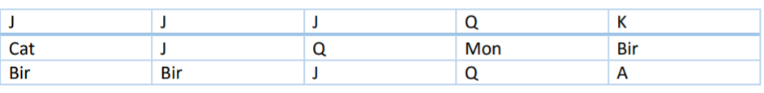

# Slot App
## Description
In this project I simulated slot machine using Lumen.

I generate a random board with 5 columns and 3 rows using 10 different symbols (9, 10, J, Q,
K, A, cat, dog, monkey and bird).

 I use the following logic for numbering each symbol on the board:
 
 0 3 6 9 12
 
 1 4 7 10 13
 
 2 5 8 11 14
 
 0 4 8 10 12
 
 2 4 6 10 14
 
 Example: [J, J, J, Q, K, cat, J, Q, monkey, bird, bird, bird, J, Q, A]
These 15 random symbols generate this:



 A pay out happens when 3 or more consecutive symbols of the same kind are present in a
payline, always starting from the first column (0,1,2). For the test consider the following
paylines:

- "0 3 6 9 12"
-  "1 4 7 10 13"
- "2 5 8 11 14"
- "0 4 8 10 12"
- "2 4 6 10 14"

From the example above 2 paylines are matched "J J J" from "**0 3 6** 9 12" and "**0 4 8** 10 12".

 Pay out return to the player the following amount:
 - 3 symbols: 20% of the bet.
 - 4 symbols: 200% of the bet.
 - 5 symbols: 1000% of the bet.
 
 Considering the above example the result on the command line will be:
 ```js
 {
 board: [J, J, J, Q, K, cat, J, Q, monkey, bird, bird, bird, J, Q, A],
 paylines: [{"0 3 6 9 12": 3}, {"0 4 8 10 12":3}],
 bet_amount: 100,
 total_win: 40
 }
```


##Instalation
after clone files
```
composer install
```
after installation for run slot please use this command in command line:

```
php artisan slot
```


Regards

Omid Rafati
